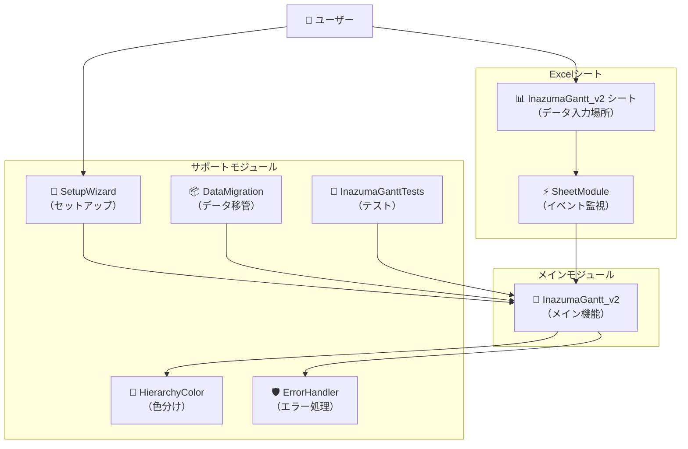
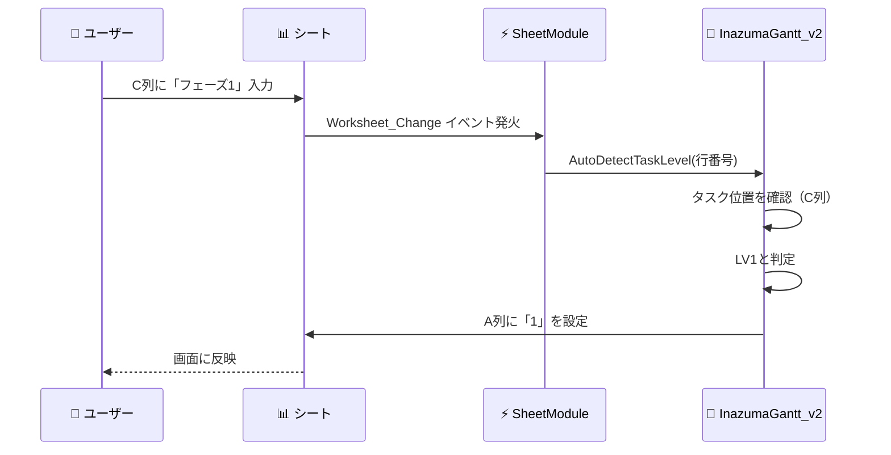
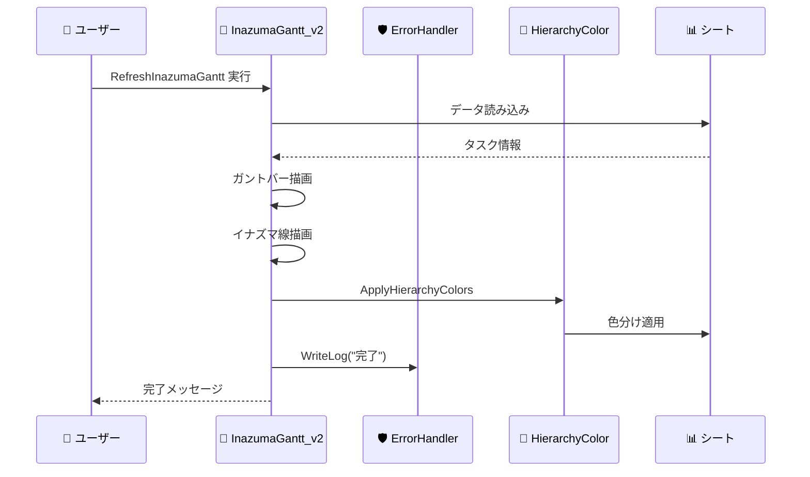
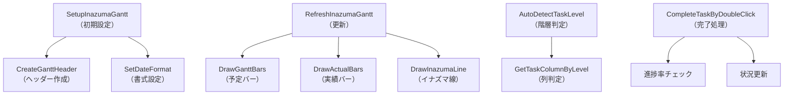
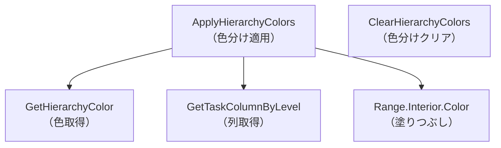

# 📐 モジュール構成と依存関係

このドキュメントは、図を使ってInazumaGantt v2の構成を説明します。

---

## 📊 モジュール構成図

### 全体像



---

## 🔄 データフロー図

### シナリオ1: タスク入力時



### シナリオ2: ガント更新時



---

## 🧩 モジュール依存関係

### 矢印の意味
- `A → B`: AがBを使用（呼び出し）
- `A ⇢ B`: Aが必要に応じてBを使用

```mermaid
graph LR
    subgraph "必須"
        Main["InazumaGantt_v2"]
        SheetMod["SheetModule"]
    end
    
    subgraph "推奨"
        Color["HierarchyColor"]
        Error["ErrorHandler"]
        Setup["SetupWizard"]
    end
    
    subgraph "任意"
        Migration["DataMigration"]
        Test["InazumaGanttTests"]
    end
    
    SheetMod --> Main
    Main --> Color
    Main ⇢ Error
    Setup --> Main
    Setup ⇢ Color
    Migration ⇢ Main
    Test --> Main
    
    style Main fill:#ff6b6b
    style SheetMod fill:#ff6b6b
    style Color fill:#4ecdc4
    style Error fill:#4ecdc4
    style Setup fill:#4ecdc4
    style Migration fill:#95e1d3
    style Test fill:#95e1d3
```

### 依存レベル

| レベル | 色 | モジュール | 説明 |
|--------|-----|-----------|------|
| 🔴 必須 | 赤 | InazumaGantt_v2<br>SheetModule | これがないと動かない |
| 🟢 推奨 | 緑 | HierarchyColor<br>ErrorHandler<br>SetupWizard | 機能や使いやすさが大幅向上 |
| 🔵 任意 | 青 | DataMigration<br>InazumaGanttTests | 特定の用途のみ |

---

## 🏗️ 階層構造

### レイヤー構造

```
┌─────────────────────────────────┐
│  ユーザーインターフェース層       │  ← ユーザーが触る部分
│  ・Excel シート                  │
│  ・SheetModule（イベント検知）    │
└─────────────────────────────────┘
            ↕
┌─────────────────────────────────┐
│  アプリケーション層               │  ← ビジネスロジック
│  ・InazumaGantt_v2（メイン処理）  │
│  ・SetupWizard（セットアップ）    │
└─────────────────────────────────┘
            ↕
┌─────────────────────────────────┐
│  サービス層                      │  ← 補助機能
│  ・HierarchyColor（色分け）       │
│  ・DataMigration（移管）         │
│  ・ErrorHandler（エラー処理）     │
│  ・InazumaGanttTests（テスト）    │
└─────────────────────────────────┘
            ↕
┌─────────────────────────────────┐
│  データ層                        │  ← データ保存
│  ・Excelシート（セル）            │
│  ・ログファイル                   │
└─────────────────────────────────┘
```

---

## 🔧 関数呼び出し図

### InazumaGantt_v2 の主要関数



### HierarchyColor の主要関数



---

## 📋 モジュール一覧表

### 詳細情報

| モジュール名 | ファイル名 | サイズ | 主要関数数 | 依存先 |
|-------------|-----------|--------|-----------|--------|
| InazumaGantt_v2 | InazumaGantt_v2_SJIS.bas | 45KB | 30+ | なし |
| HierarchyColor | HierarchyColor_SJIS.bas | 6.6KB | 5 | InazumaGantt_v2 |
| DataMigration | DataMigration_SJIS.bas | 8.7KB | 3 | InazumaGantt_v2 |
| ErrorHandler | ErrorHandler_SJIS.bas | 5.7KB | 8 | なし |
| InazumaGanttTests | InazumaGanttTests_SJIS.bas | 6.9KB | 7 | InazumaGantt_v2 |
| SetupWizard | SetupWizard_SJIS.bas | 10KB | 6 | InazumaGantt_v2 |
| SheetModule | InazumaGantt_v2_SheetModule.bas | 3.2KB | 3 | InazumaGantt_v2 |

---

## 🎯 カスタマイズポイント

### 変更しやすい部分

```
InazumaGantt_v2
  ├── 定数部分（COL_*, ROW_*）      ← 列や行の位置
  ├── COLOR_* 定数                  ← 色の設定
  └── GANTT_DAYS                    ← 表示日数

HierarchyColor
  └── COLOR_LV* 定数                ← 階層別の色

ErrorHandler
  └── ERROR_LOG_FILE                ← ログファイル名
```

### 変更が影響する部分

```
列の定義を変更
  → InazumaGantt_v2
  → HierarchyColor
  → SheetModule
  すべて修正が必要 ⚠️
```

---

## 💡 設計のポイント

### なぜこの構成なのか？

#### 1. モジュール分離
**理由**: 機能ごとに分けると、修正が簡単

**例**:
- 色を変えたい → HierarchyColorだけ修正
- エラー処理を改善 → ErrorHandlerだけ修正

#### 2. 中心にInazumaGantt_v2
**理由**: 1つのモジュールが全体を管理すると、わかりやすい

**メリット**:
- どこを見ればいいか明確
- 混乱しにくい

#### 3. SheetModuleは別
**理由**: Excelの仕様で、シートモジュールは分離が必須

---

詳細は [ARCHITECTURE.md](ARCHITECTURE.md) を参照してください。
